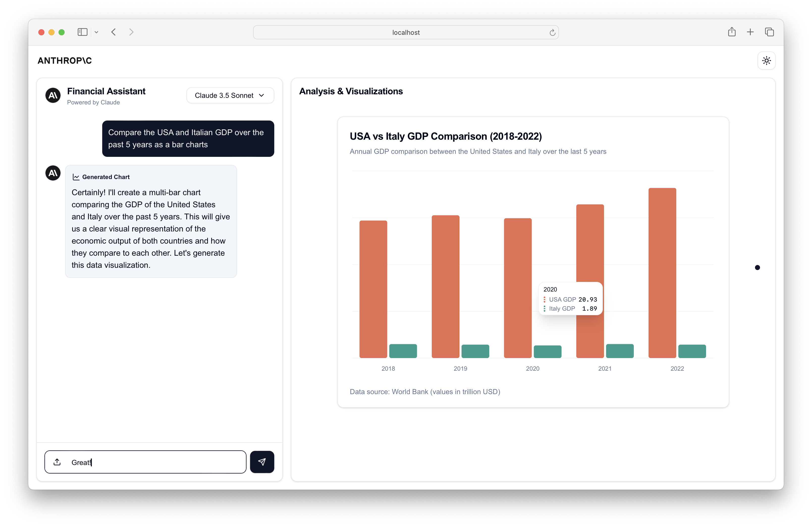
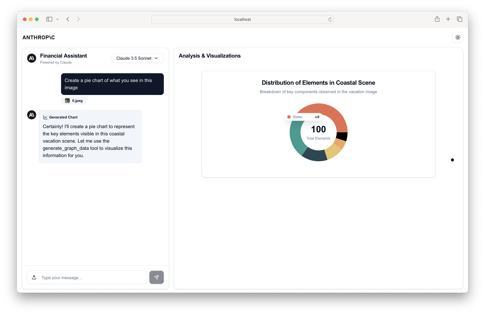

# Claude Financial Data Analyst — Subscription Edition

> 🔀 這是 [financial-data-analyst](../financial-data-analyst/) 的 **訂閱版分支**。原版用 Anthropic API（扣 API Credits），此版本走 `claude` CLI 的 OAuth，使用你的 **Pro/Max 訂閱額度**，不扣 API Credits。架構細節見 [`doc/subscription-version-notes.md`](doc/subscription-version-notes.md)。



A sophisticated Next.js application that combines Claude's capabilities with interactive data visualization to analyze financial data via chat.

## Features

- **不扣 API Credits**：走 `claude` CLI OAuth + Pro/Max 訂閱額度
- **Intelligent Data Analysis**: Powered by Claude（預設 Claude 4.5 Haiku，可切 Claude Sonnet 4.6）
- **POC 範圍**：純文字對話 + chart 生成
  - ❌ 圖片上傳後端跳過（前端 UI 仍可點，但會 `console.warn`）
  - ✅ 純文字訊息 + Q&A
- **Interactive Data Visualization**: 6 種圖表類型（與原版相同）
  - Line / Bar / Multi-Bar / Area / Stacked Area / Pie

## ⚠️ Self-Host Only

本版本**只能本機跑**。無法部署到 Vercel / Cloudflare / 任何 serverless 平台 —— 因為 SDK 需要 spawn `claude` CLI 子行程，雲端 serverless 沒有 CLI binary 也沒有 OAuth 憑證。

## Getting Started

### Prerequisites

- Node.js 18+
- `claude` CLI 已安裝且已登入 OAuth（執行 `claude --version` + `claude` 互動模式登入過一次）
- Pro 或 Max 訂閱（用 OAuth 走訂閱額度）

### Installation

1. 從 `financial-data-analyst-sub/` 目錄開始：

```bash
cd anthropic-quickstarts/financial-data-analyst-sub
npm install
```

2. **不需要 `.env.local`**。本版用 `claude` CLI 的 OAuth 認證（`~/.claude/.credentials.json`），不讀 `ANTHROPIC_API_KEY`。

   注意：如果你的 shell 環境變數有 `ANTHROPIC_API_KEY`，本版仍會強制走 OAuth（route.ts 用 SDK 的 request-scoped `env` option 清掉 API key，不污染 parent process）。

3. 確認 `claude` CLI 登入狀態：

```bash
claude --version            # 應顯示 2.1.x (Claude Code)
echo "hi" | claude -p       # 應該秒回，代表 OAuth 活著
```

4. 啟動 dev server（**port 3001**，避免跟原版 3000 衝突）：

```bash
npm run dev
```

開 [http://localhost:3001](http://localhost:3001) 進入。

## 與原版差異一覽

| 面向 | 原版（`../financial-data-analyst`） | 訂閱版（本版） |
|---|---|---|
| 認證 | `ANTHROPIC_API_KEY` | `claude` CLI OAuth |
| 扣費 | API Credits | Pro/Max 訂閱額度（不扣 Credits） |
| Runtime | Edge | Node.js |
| SDK | `@anthropic-ai/sdk` | `@anthropic-ai/claude-agent-sdk` |
| Port | 3000 | 3001 |
| 部署 | Vercel-friendly | Self-host only |
| 首次延遲 | ~1-2 秒 | ~25-30 秒（SDK warm-up） |
| 後續延遲 | ~1-2 秒 | ~12-17 秒 |
| 圖片上傳 | ✅ | ❌（POC 暫關） |

## Technology Stack

- **Frontend**:
  - Next.js 14
  - React
  - TailwindCSS
  - Shadcn/ui Components
  - Recharts (For data visualization)
  - PDF.js (For PDF processing)

- **Backend**:
  - Next.js API Routes
  - Edge Runtime
  - Anthropic SDK

## Usage Examples

The assistant can help with various financial analysis tasks:

1. **Data Extraction & Analysis**:
   - Upload financial documents
   - Extract key metrics
   - Analyze trends and patterns

2. **Visualization Creation**:
   - Generate charts based on data
   - Customize visualizations
   - Compare multiple metrics

3. **Interactive Analysis**:
   - Ask questions about the data
   - Request specific visualizations
   - Get detailed explanations

## Interesting Use Cases

While primarily designed for financial analysis, the AI assistant can be adapted for various intriguing applications:

1. **Environmental Data Analysis**:
   - Analyze climate change trends
   - Visualize pollution levels over time
   - Compare renewable energy adoption across regions

2. **Sports Performance Tracking**:
   - Upload athlete performance data
   - Generate visualizations of key metrics
   - Analyze trends and patterns in team statistics

3. **Social Media Analytics**:
   - Process engagement data from various platforms
   - Create charts showing follower growth and interaction rates
   - Analyze sentiment trends in user comments

4. **Educational Progress Tracking**:
   - Upload student performance data
   - Visualize learning progress over time
   - Compare different teaching methods or curriculums

5. **Health and Fitness Monitoring**:
   - Process personal health data from wearables
   - Create charts for metrics like steps, heart rate, and sleep patterns
   - Analyze long-term health trends and provide insights

You can even use charts and images to create interesting results, like the ability to see what's most common inside a picture using a pie chart.



